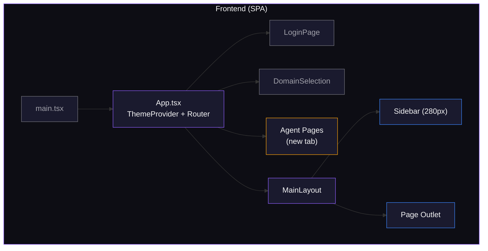
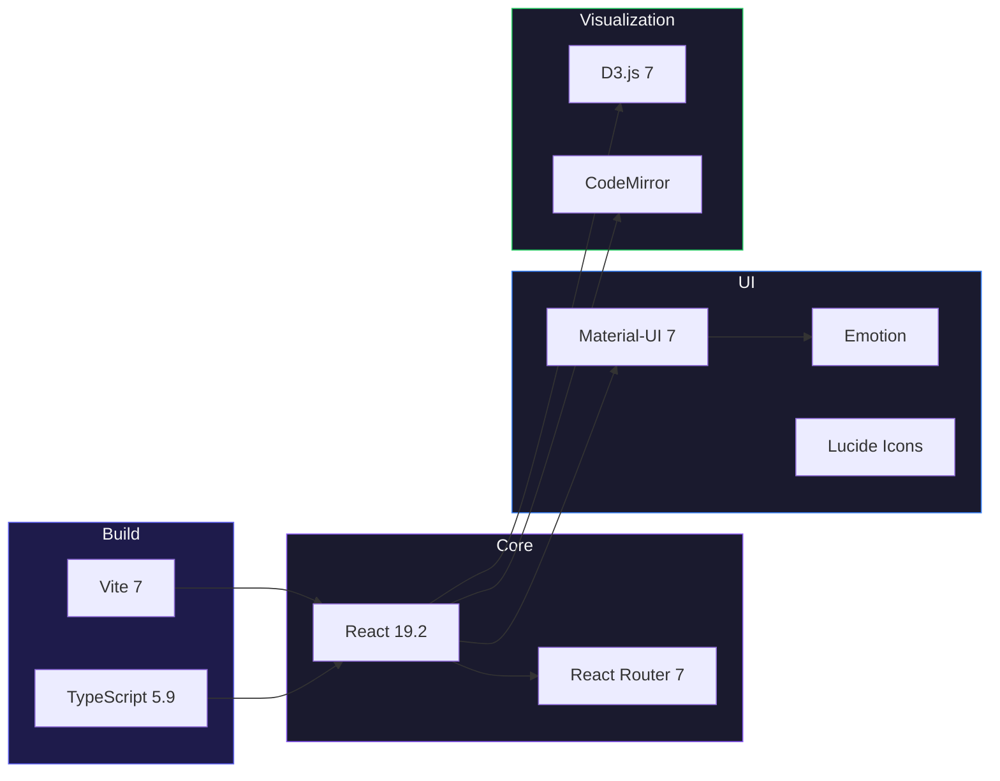
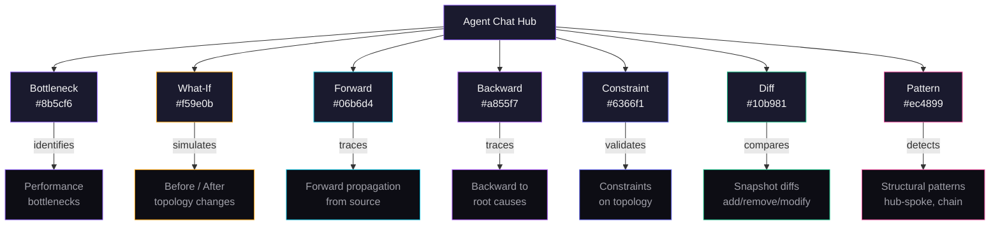
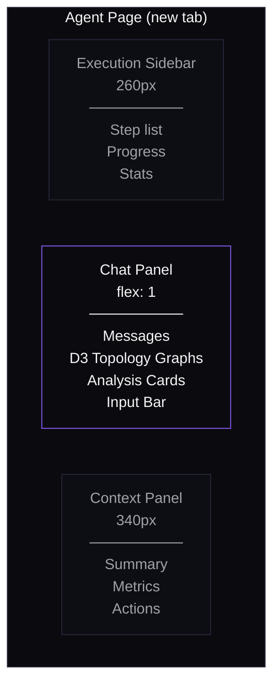
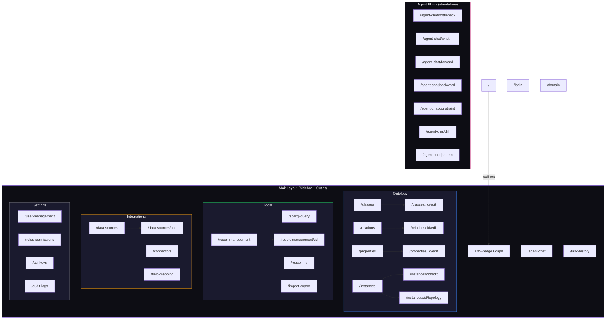
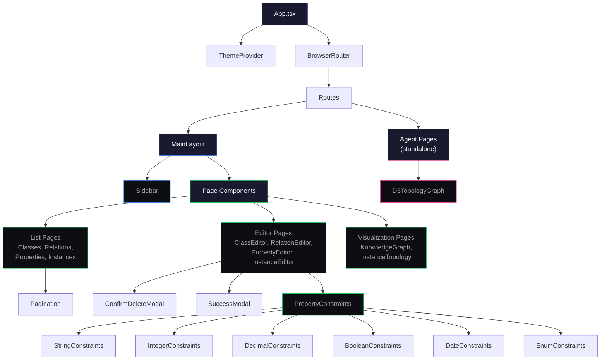

# Ontology Management System

Enterprise-grade ontology management platform for building, visualizing, and reasoning over knowledge graphs. Built with React 19, Material-UI v7, D3.js, and TypeScript.

## Architecture



## Tech Stack



## Features

### Ontology Modeling

```mermaid
erDiagram
    Class ||--o{ Property : has
    Class ||--o{ Instance : instantiates
    Class }o--o{ Relation : connected_by
    Relation }o--|| Class : from
    Relation }o--|| Class : to
    Property ||--o{ Constraint : constrained_by
    Instance }o--o{ Instance : linked_via_relation

    Class {
        string name
        string description
        string icon
        Class parent
    }
    Relation {
        string name
        string type
        Class domain
        Class range
    }
    Property {
        string name
        string datatype
        boolean required
    }
    Instance {
        string name
        Class type
        map properties
    }
```

- **Classes** -- Create and manage ontology classes with inheritance hierarchies, properties, and icons
- **Relations** -- Define typed relationships between classes (e.g., `connects_to`, `uses`)
- **Properties** -- Configure properties with type-specific constraints (String, Integer, Decimal, Boolean, Date, Enum)
- **Instances** -- Manage concrete instances of ontology classes with topology visualization

### Knowledge Graph

- Interactive D3.js graph visualization with drag, zoom, and selection
- Real-time node/link highlighting with glow effects
- Search and filter across classes, relations, and properties

### AI Agent Workflows

Seven specialized agent conversation flows, each with a 3-panel layout and D3.js topology graphs:



Each agent page layout:



### Tools

- **SPARQL Query** -- CodeMirror-based SPARQL editor with syntax highlighting
- **Reasoning** -- OWL reasoning engine integration
- **Import/Export** -- Bulk ontology data import and export

### Integrations

- **Data Sources** -- Connect to external databases and services
- **Connectors** -- Manage integration connectors
- **Field Mapping** -- Map fields between external sources and ontology properties

### Administration

- **Reports** -- Report management and detail views
- **User Management** -- User accounts and profiles
- **Roles & Permissions** -- Role-based access control
- **API Keys** -- API key management
- **Audit Logs** -- Activity tracking

## Route Map



## Component Hierarchy



## Project Structure

```
app/
├── src/
│   ├── main.tsx                  # Entry point
│   ├── App.tsx                   # Router and theme provider
│   ├── MainLayout.tsx            # Sidebar + content layout
│   ├── LoginPage.tsx             # Authentication
│   ├── DomainSelection.tsx       # Domain/workspace selector
│   ├── theme.ts                  # MUI dark theme configuration
│   ├── components/
│   │   ├── Sidebar.tsx           # Navigation drawer (280px)
│   │   ├── D3TopologyGraph.tsx   # Shared D3 topology graph
│   │   ├── Pagination.tsx        # Reusable pagination
│   │   ├── PagePlaceholder.tsx   # Stub page component
│   │   ├── ConfirmDeleteModal.tsx
│   │   ├── SuccessModal.tsx
│   │   └── PropertyConstraints/  # Type-specific constraint editors
│   └── pages/                    # 30 page components
│       ├── KnowledgeGraphPage.tsx
│       ├── Classes/Relations/Properties/InstancesPage.tsx
│       ├── *EditorPage.tsx
│       ├── SparqlQueryPage.tsx
│       ├── ReasoningPage.tsx
│       ├── ImportExportPage.tsx
│       ├── Agent*Page.tsx        # 7 agent conversation flows
│       ├── DataSourcesPage.tsx
│       ├── ConnectorsPage.tsx
│       ├── FieldMappingPage.tsx
│       ├── Report*Page.tsx
│       ├── UserManagementPage.tsx
│       └── RolesPermissionsPage.tsx
├── package.json
├── vite.config.ts
├── tsconfig.json
└── eslint.config.js
```

## Theme

Dark theme with a purple accent:

| Token | Value |
|-------|-------|
| Primary | `#8b5cf6` |
| Background | `#0a0a0f` |
| Paper | `#0d0d14` |
| Text Primary | `#f4f4f5` |
| Text Secondary | `#a1a1aa` |
| Divider | `#27273a` |

## Getting Started

```bash
cd app
npm install
npm run dev
```

Open `http://localhost:5173/` in the browser.

## Scripts

| Command | Description |
|---------|-------------|
| `npm run dev` | Start Vite dev server with HMR |
| `npm run build` | Type-check and build for production |
| `npm run lint` | Run ESLint |
| `npm run preview` | Preview production build |
